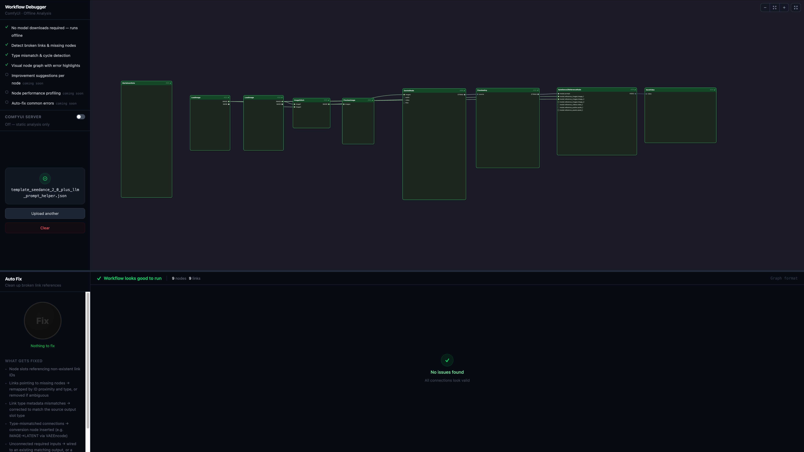
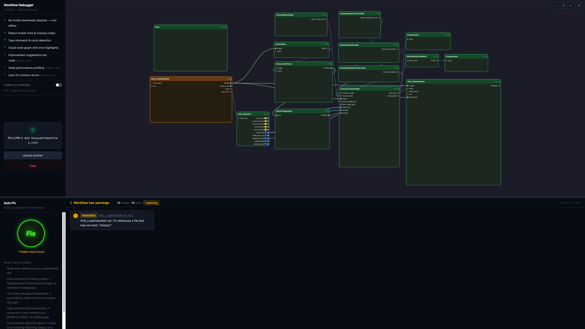
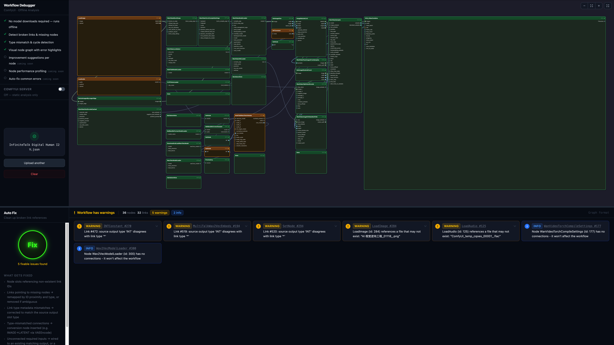

# ComfyUI 工作流调试器 (ComfyUI Workflow Debugger)

[🌐 English](README.md) | [🇨🇳 简体中文](README.zh.md)

**https://comfy-workflow-debugger.netlify.app/**

## 维护记录

| 维护日期 | 维护人 | 维护内容 | 备注/状态 |
| :--- | :--- | :--- | :--- |
| 2026-05-25 | Antigravity | 同步 ComfyUI 后端与 ComfyUI_frontend 节点定义及类型，更新 UploadPanel 静态分析提示文本 | 已同步且测试通过 |

一个免费的、基于浏览器的工具，可用于检查您的 ComfyUI 工作流问题并自动修复它们 —— 无需安装 ComfyUI。

## 截图

*干净的工作流 —— 所有连接有效，未发现问题*

*带有警告的工作流 —— 检测到过期的文件引用，有 1 个可修复问题*

*复杂的工作流 —— 类型不匹配、过期引用和孤立节点，有 5 个可修复问题*

## 如何使用

**步骤 1 — 上传您的工作流**

打开应用程序并拖拽您的 ComfyUI 工作流 `.json` 文件，或点击浏览上传。支持标准图格式（*Save*）和 API 格式（*Save (API Format)*）。

**步骤 2 — 查看诊断**

该工具会立即扫描您的工作流并列出发现的所有问题（按严重程度分组）：阻止工作流运行的错误（Error）、可能导致意外结果的警告（Warning）以及提示信息（Info）。

**步骤 3 — 修复问题**

- 点击 **Fix All** 一键修复所有可修复的问题
- 或者，如果您想要更多控制，可以逐个类别进行修复

**步骤 4 — 下载修复后的工作流**

下载修复后的工作流 JSON 并将其重新加载到 ComfyUI 中。

**可选：** 连接到正在运行的 ComfyUI 实例，以同时检查特定于您的配置的缺失自定义节点和无效参数值。

## 诊断项

该工具会扫描您的工作流并标记：

- **损坏的连接** —— 指向已不存在的链接或节点的导线
- **类型不匹配** —— 期望不同数据类型的节点之间的连接
- **无效参数值** —— 会在运行时导致错误的空值或超出范围的值
- **禁用的节点** —— 在其他节点仍依赖其输出时，被静音或旁路的节点
- **无输出节点** —— 没有 Save Image 或其他输出节点的工作流，这会导致无法产生任何结果
- **死循环** —— 节点之间会导致无法执行的循环依赖
- **孤立节点** —— 对输出没有任何影响的无连接节点
- **过期的文件引用** —— 指向已被移动或删除的文件路径的图像或视频路径
- **缺失的自定义节点** *（需要连接服务器）* —— 在您的 ComfyUI 实例中未安装的节点类型

## 自动修复

点击 **Fix** 可以一键自动修复所有可修复的问题：

- **移除损坏的连接** —— 清除悬空导线并重新映射可恢复的连接
- **重新启用禁用的节点** —— 恢复工作流仍需要的静音或旁路节点
- **插入类型转换器** —— 在不匹配的连接之间添加适当的转换节点，以使数据能正确流动
- **连接未连接的输入** —— 将可用的输出连接到没有插入任何东西的必填输入
- **重置无效值** —— 用安全默认值替换空值或 Null 参数值
- **恢复文件引用** —— 用占位测试数据替换缺失的文件路径，以便工作流可以运行

## 节点模式更新

内置的节点定义直接源自 [官方 ComfyUI 仓库](https://github.com/comfyanonymous/ComfyUI) —— 这是 ComfyUI 自身使用的相同数据源。不包含任何二级或第三方数据。

ComfyUI 核心遵循每周发布周期（通常是周一）。本工具在 ComfyUI 发布后的每周二同步内置节点定义。如果 ComfyUI 延迟发布，此处的定义更新也会相应延迟。

为了始终针对您 ComfyUI 实例中安装的确切节点进行检查，请将工具连接到您正在运行缺陷检查的 ComfyUI 服务器 —— 这将完全绕过内置定义。
